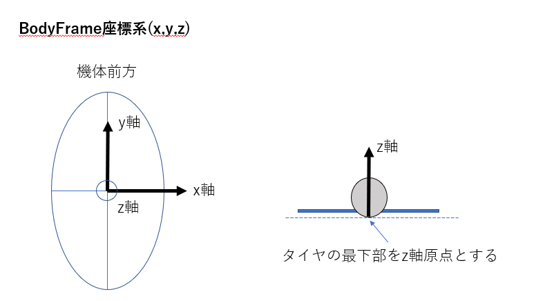
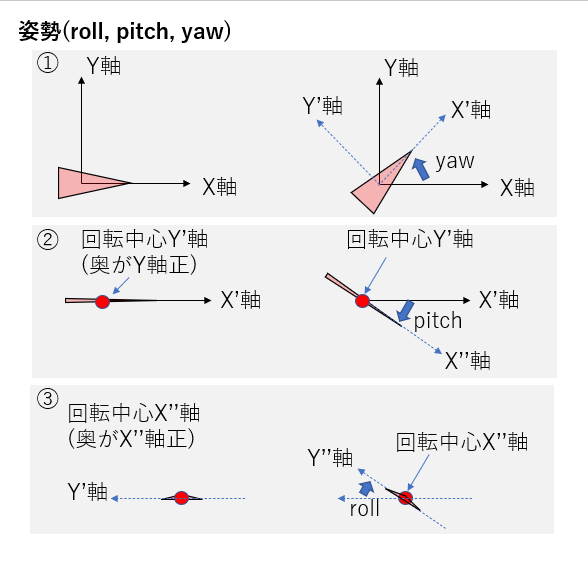
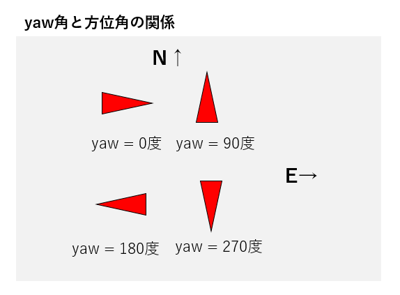

# BodyFrame座標系
機体に固定され機体と共に動く座標系をBodyFrame座標系と呼ぶことにする。



# 迷路座標系
迷路に固定された座標系を迷路座標系と呼ぶことにする。

- 迷路座標系にはENU座標右手系を採用する
- 原点(0,0,0)は迷路スタート区画の左下柱の中心とする 


# 機体姿勢
機体姿勢roll、 pitch、 yawは以下の手順で機体に回転操作を施した際の角度と定める。

0. 機体をXYZ座標原点に機首がX軸正の向きに置く
1. Z軸を中心にyaw度回転
2. 1で回転後のY’軸を中心にpitch度回転
3. 2で回転後のX’’軸を中心にroll度回転



## yaw角と方位角の関係
方位とyaw角の関係を以下に示す。

```
北: 90度
東: 0度/360度
南: 270度
西: 180度
```



# 迷路座標
スタート区画は(X,Y) = (0,0)、X軸は東が正、Y軸は北が正とする。
